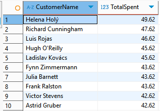
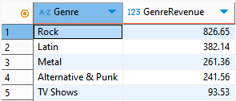
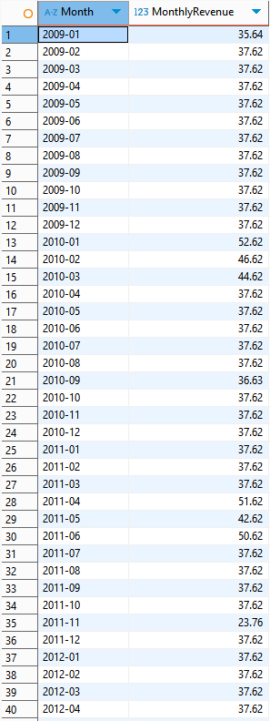
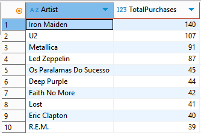
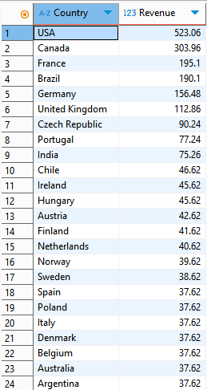
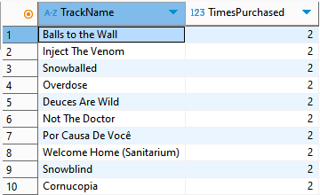
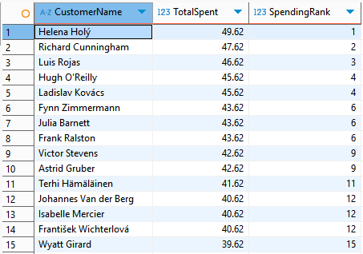

# 🎵 Chinook SQL Analysis

This is a SQL-based data analysis project using the Chinook Music Store dataset. The goal is to uncover business insights related to customers, music genres, artist popularity, and sales performance using real-world SQL techniques.

---

## 📌 Objectives

- Analyze customer spending and identify high-value customers  
- Discover top-performing genres and tracks  
- Track monthly revenue trends for business seasonality  
- Use SQL to answer key music business questions

---

## 🛠️ Tools & Technologies

- SQL (SQLite queried using DBeaver)
- SQL Concepts: Joins, Aggregations, Subqueries, Window Functions
- Dataset: [Chinook SQLite Database](https://github.com/lerocha/chinook-database)

--

## 📊 Sample Business Questions and Output

### 1. 🏆 Top Customers by Revenue
Which customers have spent the most money on music?

---

### 2. 🎧 Top Genres by Revenue
Which music genres generate the highest sales?

---

### 3. 📈 Monthly Revenue Trend
How does revenue change over time?

---

### 4. 🎤 Most Popular Artists
Which artists have the most purchased tracks?

---

### 5. 🌎 Top Countries by Revenue
Which countries bring in the most revenue?

---

### 6. 🛍️ Most Purchased Tracks
What are the most frequently purchased tracks?

---

### 7. 🧠 Rank Customers by Total Spend
Rank customers based on total spend using window functions.

---

## 📬 Contact

Created by [Bilal Abdul Sathar](https://www.linkedin.com/in/bilalas/)  
Open to feedback, collaboration, and data opportunities!
